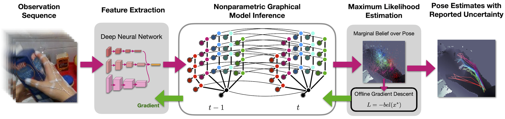

# DNBP: Differentiable Nonparametric Belief Propagation



## Dependencies

* Linux (tested on Ubuntu 18.04)
* Python 3.7
* CUDA 10.2

## Setup Instructions
Installation of dependencies is managed with [anaconda](https://conda.io/projects/conda/en/latest/index.html). For reproducibility, the state of the development environment is captured in the `environment.yml` file. These dependencies can be installed into a `dnbp-env` conda environment using the following steps:

```bash
conda env create -f environment.yml
conda activate dnbp-env
pip install -e .
```

Once the environment is installed and activated, all dependencies for this repository will be satisfied. Once finished with experiments, you can simply close your terminal or run `conda deactivate` to exit the conda environment. To remove the environment, run `conda remove --name dnbp-env --all`.

### Setup without Anaconda

Alternatively, minimal setup without Anaconda is also possible. For example, by using the `venv` python module to create a virtual environment containing project dependencies. To setup the project in this fashion, run the following:
```bash
python3.7 -m venv .venv/dnbp-env
source .venv/dnbp-env/bin/activate
pip install --upgrade pip
pip install -r requirements.txt
pip install -e .
```

When finished with experiments, run `deactivate` to exit environment. To remove the environment, remove the `.venv/dnbp-env/` directory.

## Pendulum Tracking

<details>
<summary><strong>Setup</strong></summary>

- Download dataset from ['pendulum.zip' google drive](https://drive.google.com/drive/folders/10uiGUYoLM1B-jwoS8fUzLbfwId62hE_y?usp=sharing)

- Extract pendulum dataset to `./data/pendulum`

</details>

<details>
<summary><strong>Training</strong></summary>

Train DNBP Model:

- `python experiments/pendulum_tracking/dnbp_train.py ./experiments/pendulum_tracking/dnbp_config_file.json`

Train LSTM Model:

- `python experiments/pendulum_tracking/lstm_train.py ./experiments/pendulum_tracking/lstm_config_file.json`

</details>

<details>
<summary><strong>Evaluation</strong></summary>

- Train new models or download pre-trained models from ['pendulum_models.zip' google drive](https://drive.google.com/drive/folders/10uiGUYoLM1B-jwoS8fUzLbfwId62hE_y?usp=sharing)

- If using pre-trained models, extract compressed .zip files to `./experiments/pendulum_tracking/dnbp_models/` and `./experiments/pendulum_tracking/lstm_models/`

- To plot pre-computed evaluation results, run: `python ./experiments/pendulum_tracking/helpers/plot_quantitative.py`

- To re-test models and plot results, run: `./experiments/pendulum_tracking/run_evaluations.sh`

- If using a newly trained model, you may need to adjust the hardcoded `epoch` values in the above evaluation files.

</details>


## Spider Tracking

<details>
<summary><strong>Setup</strong></summary>

- Download dataset from ['spider.zip' google drive](https://drive.google.com/drive/folders/10uiGUYoLM1B-jwoS8fUzLbfwId62hE_y?usp=sharing)

- Extract spider dataset to `./data/spider`

</details>

<details>
<summary><strong>Training</strong></summary>

Train DNBP Model:

- `python ./experiments/spider_tracking/dnbp_train.py ./experiments/spider_tracking/dnbp_config_file.json`

Train LSTM Model:

- `python ./experiments/spider_tracking/lstm_train.py ./experiments/spider_tracking/lstm_config_file.json`

</details>

<details>
<summary><strong>Evaluation</strong></summary>

- Train new models or download pre-trained models from ['spider_models.zip' google drive](https://drive.google.com/drive/folders/10uiGUYoLM1B-jwoS8fUzLbfwId62hE_y?usp=sharing)

- If using pre-trained models, extract compressed .zip files to `./experiments/spider_tracking/dnbp_models/` and `./experiments/spider_tracking/lstm_models/`

- To plot pre-computed evaluation results, run: `python ./experiments/spider_tracking/helpers/plot_quantitative.py`

- To re-test models and plot results, run: `./experiments/spider_tracking/run_evaluations.sh`

- If using a newly trained model, you may need to adjust the hardcoded `epoch` values in the above evaluation files.

</details>


## Hand Tracking

<details>
<summary><strong>Setup</strong></summary>

- Download dataset from [F-PHAB authors](https://guiggh.github.io/publications/first-person-hands/) (Garcia-Hernando et al.)

- Extract F-PHAB dataset to `./data/hand_tracking/F-PHAB`

To preprocess dataset (image cropping)

```
cd ./data/hand_tracking
python preprocess_hands.py
python preprocess_rgb_crops.py
cd ../..
```

</details>

<details>
<summary><strong>Training</strong></summary>

Train DNBP Model:

- `python ./experiments/hand_tracking/dnbp_train.py ./experiments/hand_tracking/dnbp_config_file.json`

</details>

<details>
<summary><strong>Evaluation</strong></summary>

- If using pre-trained models, extract compressed .zip files to `./experiments/hand_tracking/dnbp_models/`

- To plot pre-computed evaluation results, run: `python ./experiments/hand_tracking/helpers/plot_quantitative.py`

- To re-test models and plot results, run: `./experiments/hand_tracking/run_evaluations.sh`

- If using a newly trained model, you may need to adjust the hardcoded `epoch` values in the above evaluation files.

</details>


## Citation

```
@article{opipari2021dnbp,
  author = {Opipari, Anthony and Chen, Chao and Wang, Shoutian and Pavlasek, Jana and Desingh, Karthik and Jenkins, Odest Chadwicke},
  title = {Differentiable Nonparametric Belief Propagation},
  year = {2021},
  journal={arXiv preprint arXiv:2101.05948}
}
```